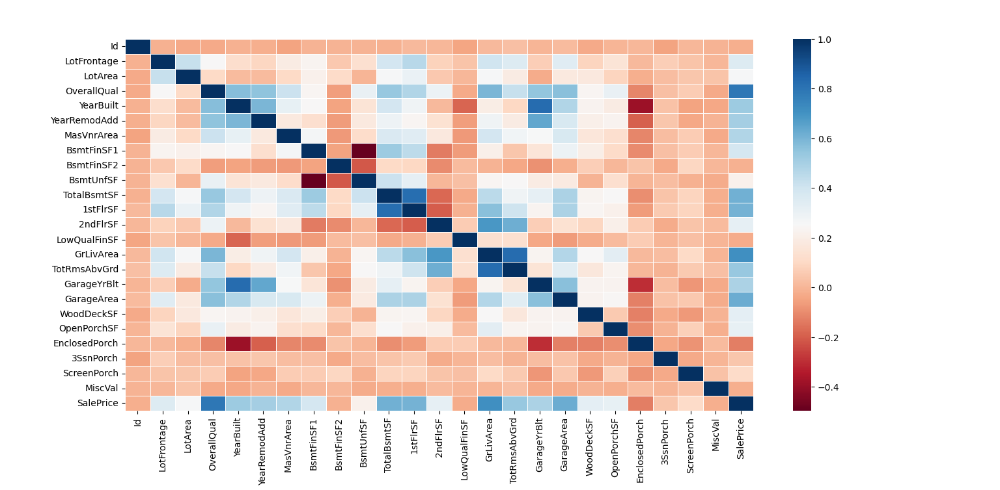
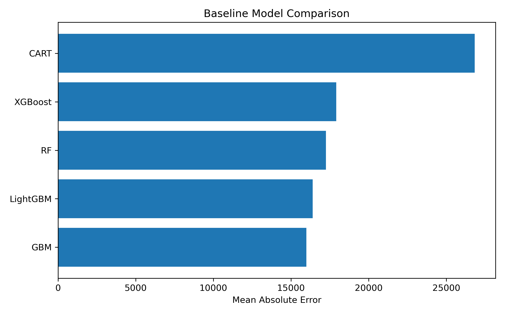
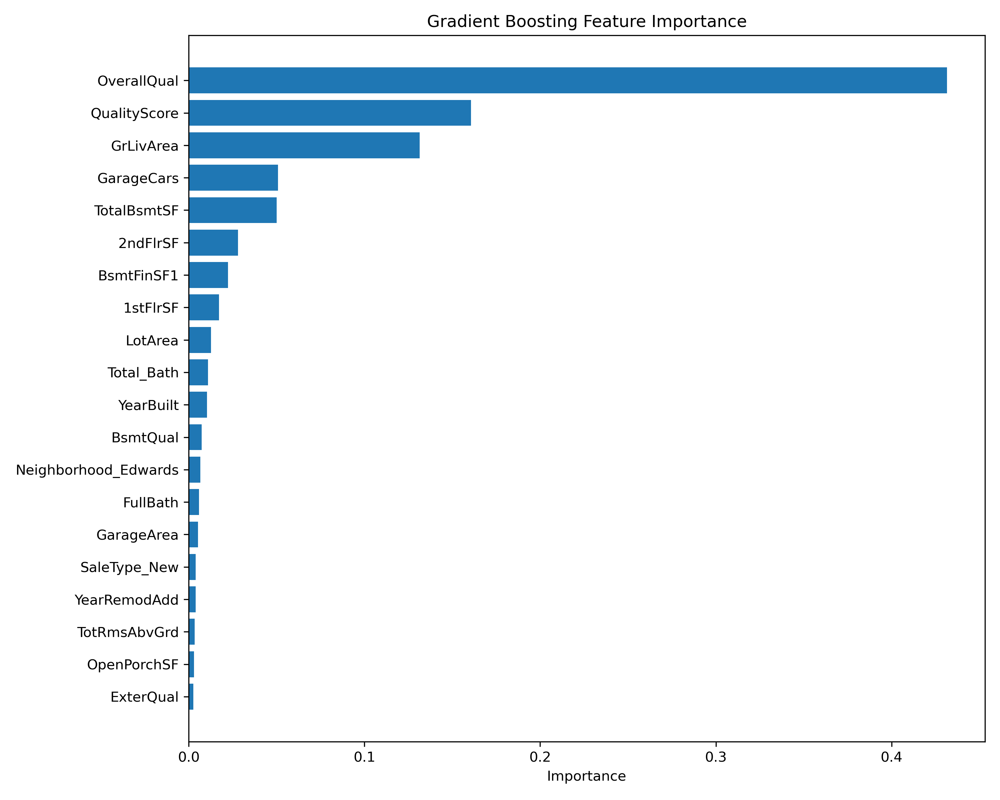

# House Price Prediction using Machine Learning


An end-to-end machine learning pipeline for predicting residential house prices using feature engineering, hyperparameter optimization, and ensemble learning techniques.

---

# Project Overview

This project predicts residential house prices using the **House Prices: Advanced Regression Techniques** dataset provided by Kaggle.

Rather than focusing only on model accuracy, the project demonstrates a complete machine learning workflow—from exploratory data analysis to preprocessing, feature engineering, model comparison, hyperparameter optimization, ensemble learning, and prediction.

The pipeline includes:

- Exploratory Data Analysis (EDA)
- Missing Value Handling
- Feature Engineering
- Outlier Treatment
- Rare Encoding
- Label Encoding
- One-Hot Encoding
- Feature Scaling
- Baseline Model Comparison
- Hyperparameter Optimization
- Ensemble Learning (Voting Regressor)
- Model Serialization with Joblib

---

# Dataset

This project uses the **House Prices: Advanced Regression Techniques** dataset from Kaggle.

- **Training Samples:** 1460
- **Features:** 81
- **Target Variable:** SalePrice
- **Problem Type:** Regression

Dataset:

https://www.kaggle.com/competitions/house-prices-advanced-regression-techniques

---

# Project Workflow

```text
Raw Dataset
      │
      ▼
Exploratory Data Analysis
      │
      ▼
Missing Value Handling
      │
      ▼
Feature Engineering
      │
      ▼
Outlier Treatment
      │
      ▼
Rare Encoding
      │
      ▼
Label Encoding
      │
      ▼
One-Hot Encoding
      │
      ▼
Feature Scaling
      │
      ▼
Baseline Models
      │
      ▼
Hyperparameter Optimization
      │
      ▼
Voting Regressor
      │
      ▼
Prediction
```

---

# Exploratory Data Analysis

The exploratory analysis includes:

- Dataset overview
- Variable type identification
- Numerical feature analysis
- Categorical feature analysis
- Missing value analysis
- Missing values vs. target analysis
- Rare category analysis
- Outlier detection
- Correlation analysis

### Correlation Matrix

The figure below illustrates the relationships among numerical variables and was used to identify highly correlated features during exploratory data analysis.

<p align="center">
    
</p>

---

# Data Preprocessing & Feature Engineering

## Missing Value Handling

Different imputation strategies were applied according to feature characteristics.

- Median Imputation
- Mode Imputation
- Structural `"None"` Assignment
- Garage/Basement specific preprocessing

## Feature Engineering

The following new features were created:

| Feature | Description |
|----------|-------------|
| **QualityScore** | Overall quality score created from quality-related variables |
| **Total_Bath** | Total number of bathrooms |
| **HAS_POOL** | Indicates whether the property has a swimming pool |
| **IS_RENOVATED** | Indicates whether the property has been renovated |
| **YearsSinceRemodel** | Years elapsed since the last remodeling |

## Encoding

- Rare Encoding
- Label Encoding
- One-Hot Encoding

## Scaling

- RobustScaler

---

# Machine Learning Models

The following regression algorithms were evaluated using **3-Fold Cross Validation**.

- Linear Regression
- KNeighbors Regressor
- Decision Tree Regressor
- Random Forest Regressor
- AdaBoost Regressor
- Gradient Boosting Regressor
- XGBoost Regressor
- LightGBM Regressor

### Baseline Model Comparison

The figure below compares all baseline models using **Mean Absolute Error (MAE)**.

Lower MAE values indicate better predictive performance.

<p align="center">
    
</p>

---

# Model Performance

Baseline models were evaluated using **3-Fold Cross Validation** with **Mean Absolute Error (MAE)**.

| Model | CV MAE |
|----------------------|---------:|
| Linear Regression | 19,060.66 |
| KNeighbors Regressor | 63,440.81 |
| Decision Tree Regressor | 24,954.95 |
| Random Forest Regressor | 16,994.41 |
| AdaBoost Regressor | 23,832.75 |
| **Gradient Boosting Regressor** | **15,770.31** |
| XGBoost Regressor | 17,051.22 |
| LightGBM Regressor | 16,252.90 |

Among the evaluated baseline models, **Gradient Boosting Regressor** achieved the lowest Mean Absolute Error (MAE), making it the strongest individual model before ensemble learning.

---

# Hyperparameter Optimization

Hyperparameter tuning was performed using **GridSearchCV**.

The following algorithms were optimized:

- Decision Tree
- Random Forest
- Gradient Boosting
- XGBoost
- LightGBM

After optimization, the best-performing models were combined into a Voting Regressor to improve overall prediction performance.

---

# Ensemble Learning

The optimized models were combined using a **Voting Regressor**.

The final ensemble model achieved the following cross-validation performance:

| Metric | Score |
|---------|------:|
| **MAE** | **14,810.21** |
| **MSE** | **680,033,315.28** |
| **R² Score** | **0.8938** |

The trained ensemble model is serialized using Joblib for future predictions.

```python
joblib.dump(voting_reg, "voting_reg.pkl")
```

### Feature Importance (Gradient Boosting Regressor)

The figure below illustrates the relative contribution of each feature learned by the optimized Gradient Boosting model. Features with higher importance have a greater influence on the model's predictions.

<p align="center">
    
</p>

---

# Prediction

The trained model can be loaded and used to predict unseen observations.

```python
model = joblib.load("voting_reg.pkl")

prediction = model.predict(random_house)

print(prediction)
```

The prediction pipeline automatically applies the same preprocessing and feature engineering steps used during model training before generating the final house price prediction.

---

# Project Structure

```text
HousePrice/
│
├── datasets/
│   └── housepricetrain.csv
│
├── images/
│   ├── correlation_matrix.png
│   ├── feature_importance.png
│   └── model_comparison.png
│
├── HP_Research.py
├── HP_Pipeline.py
├── HP_Prediction.py
├── utils.py
│
├── voting_reg.pkl
├── requirements.txt
├── README.md
└── .gitignore
```

---

# Installation

Clone the repository.

```bash
git clone https://github.com/yzBAYKARA/HousePrice.git
```

Install the required dependencies.

```bash
pip install -r requirements.txt
```

---

# Usage

### Exploratory Data Analysis

Runs exploratory data analysis and investigates the dataset.

```bash
python HP_Research.py
```

### Model Training

Trains baseline models, performs hyperparameter optimization, builds the Voting Regressor, and saves the trained model.

```bash
python HP_Pipeline.py
```

### Prediction

Loads the serialized model and predicts the sale price of a sample house.

```bash
python HP_Prediction.py
```

---

# Dependencies

Major libraries used in this project:

- pandas
- numpy
- matplotlib
- seaborn
- scikit-learn
- xgboost
- lightgbm
- joblib

See **requirements.txt** for the complete dependency list.

---

# Future Improvements

Potential future enhancements include:

- Deploying the model using FastAPI
- Model explainability with SHAP
- Hyperparameter optimization using Optuna
- Automated preprocessing using `sklearn.pipeline.Pipeline`
- Docker containerization
- Kaggle leaderboard evaluation

---

# Author

**Yusuf Ziya BAYKARA**

GitHub: https://github.com/yzBAYKARA
